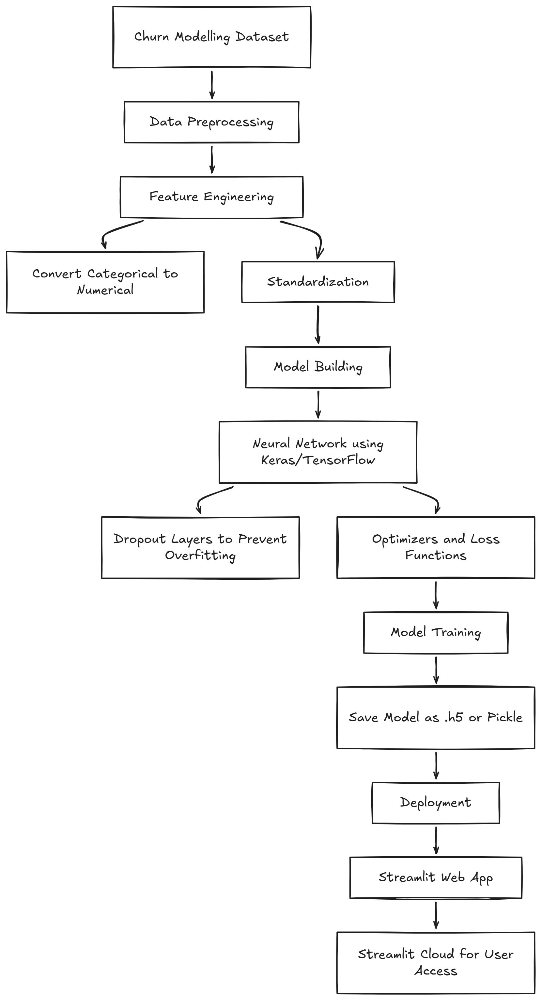

## 📌 Project 
**Customer Churn Prediction using ANN**

<br/>


### 📖 Description  
Customer churn — when clients stop using a company’s services — is a critical challenge for banks and financial institutions. High churn rates directly impact profitability and long-term growth. The objective of this project is to build a **classification model** that predicts whether a customer is likely to exit based on demographic, financial, and behavioral attributes.  

The workflow involves:  
- **Feature Engineering (FE)**: Converting categorical variables into numerical form, applying standardization, and preparing balanced features.  
- **Model Development**: Training a neural network using **Keras/TensorFlow**, with dropout layers to prevent overfitting.  
- **Deployment**: Saving the trained model in `.h5` format and integrating it into a **Streamlit web application** for real-time predictions.  

This approach enables businesses to proactively identify at-risk customers and design retention strategies.

<br/>

### 📊 Dataset Summary  
- **Source**: Bank customer dataset (10,000+ records).  
- **Features**: Customer ID, surname, credit score, geography, gender, age, tenure, balance, number of products, credit card ownership, activity status, estimated salary.  
- **Target Variable**: `Exited` (1 = customer churned, 0 = customer retained).  
- **Nature**: Mixed categorical and numerical data requiring preprocessing.  

<br/>

#### Workflow


<br/>


## 🔧 Setup & Installation

1. Create conda virtual environment at your project root dirctrory
    ```bash
    conda create -p venv python==3.12 -y
    ```
2. Create `requirements.txt` file
Inside this txt file mentions all dependencies:
    ```text
    tensorflow==2.21.0      # tensorflow cpu
    pandas
    numpy
    matplotlib
    scikit-learn
    tensorboard
    streamlit
    ```
3. Install all dependencies
    ```bash
    pip install -r requirements.txt
    ```

<br/>

## Deploy the app in the streamlit cloud
1. Upload project to github
2. Go to streamlit clould > sign up > deploy the app using github project link